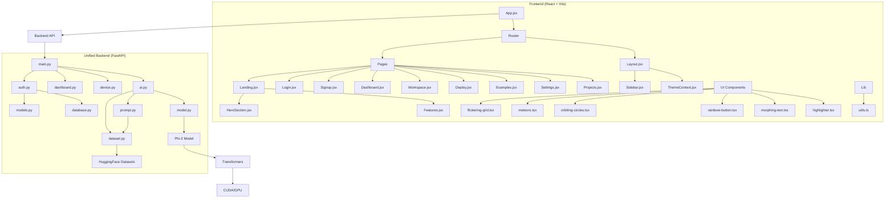

VIDEO  = {  ]
### Frontend (somethingaiiot/)
- **Framework**: React 18 with Vite
- **Routing**: React Router
- **Styling**: Tailwind CSS with custom components
- **State Management**: React Context (Theme)
- **UI Library**: Custom components with animations

### Unified Backend (backend/)
- **Framework**: FastAPI
- **AI Model**: Microsoft Phi-2 (via Transformers)
- **Dataset**: Open Schematics from HuggingFace
- **Features**: Authentication, dashboard data, device simulation, AI code generation
- **Database**: JSON file persistence


This template provides a minimal setup to get React working in Vite with HMR and some ESLint rules.

Currently, two official plugins are available:

- [@vitejs/plugin-react](https://github.com/vitejs/vite-plugin-react/blob/main/packages/plugin-react) uses [Babel](https://babeljs.io/) for Fast Refresh
- [@vitejs/plugin-react-swc](https://github.com/vitejs/vite-plugin-react/blob/main/packages/plugin-react-swc) uses [SWC](https://swc.rs/) for Fast Refresh

## Expanding the ESLint configuration

If you are developing a production application, we recommend using TypeScript with type-aware lint rules enabled. Check out the [TS template](https://github.com/vitejs/vite/tree/main/packages/create-vite/template-react-ts) for information on how to integrate TypeScript and [`typescript-eslint`](https://typescript-eslint.io) in your project.
# somethingaiiot
****
# AI-IOT-ASTRA Project Structure Diagram

## Overview
AI-IOT-ASTRA is an AI-powered IoT learning platform with a unified backend service and a React frontend. The system allows users to generate IoT code using AI, simulate devices, and manage projects.

## Architecture



## Key Components

### Frontend (somethingaiiot/)
- **Framework**: React 18 with Vite
- **Routing**: React Router
- **Styling**: Tailwind CSS with custom components
- **State Management**: React Context (Theme)
- **UI Library**: Custom components with animations

### Unified Backend (backend/)
- **Framework**: FastAPI
- **AI Model**: Microsoft Phi-2 (via Transformers)
- **Dataset**: Open Schematics from HuggingFace
- **Features**: Authentication, dashboard data, device simulation, AI code generation
- **Database**: JSON file persistence

## Data Flow

1. User interacts with React frontend
2. Frontend calls unified backend API
3. Backend handles authentication, AI code generation, device simulation
4. Phi-2 model generates IoT code with dataset context
5. Results displayed in frontend with real-time updates
6. User data persisted to JSON files

## Dependencies

### Python Backends
- fastapi
- pydantic
- uvicorn
- torch
- transformers
- requests
- passlib[bcrypt]

### Frontend
- react
- react-dom
- react-router-dom
- tailwindcss
- lucide-react
- @theme-toggles/react
- react-theme-switch-animation
- @monaco-editor/react
- clsx
- tailwind-merge

## File Structure

```
ai iot mvp/
├── backend/           # Unified FastAPI backend
│   ├── main.py        # FastAPI app with all routes
│   ├── auth.py        # Authentication with bcrypt
│   ├── dashboard.py   # Dashboard data
│   ├── device.py      # Device simulation
│   ├── ai.py          # AI code generation
│   ├── models.py      # Pydantic models
│   ├── database.py    # Persistent JSON database
│   ├── model.py       # Phi-2 model loading/generation
│   ├── prompt.py      # Prompt building with dataset
│   ├── dataset.py     # HuggingFace dataset fetching
│   ├── requirements.txt
│   └── test_backend.py
├── somethingaiiot/    # React frontend
│   ├── src/
│   │   ├── App.jsx
│   │   ├── main.jsx
│   │   ├── components/
│   │   │   ├── Layout.jsx
│   │   │   ├── Sidebar.jsx
│   │   │   ├── Landing/
│   │   │   │   ├── HeroSection.jsx
│   │   │   │   └── Features.jsx
│   │   │   └── ui/     # Custom UI components
│   │   ├── pages/     # Route components
│   │   ├── contexts/  # React contexts
│   │   └── lib/       # Utilities
│   └── package.json
└── plans/             # Documentation
    └── structure.md
